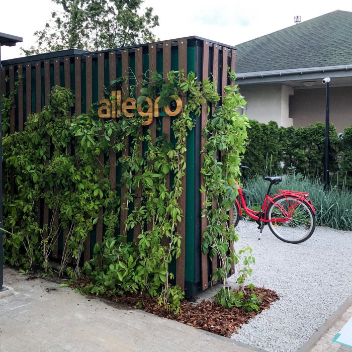

!INCLUDE "htm/intergram.html"

### **Проект Allegro**

 

------------------------

Компанія "Алегро" підписала з "Модерн - Експо" угоду про наміри щодо постачання автоматизованої системи зберігання посилок для збору і відправки посилок.
До кінця 2021 року платформа планує встановити першу партію з 1500 пристроїв в містах по всій Польщі.

Власна мережа шафок для посилок Allegro прискорить процес доставки і зробить покупки на Allegro ще більш зручними.
Клієнти Allegro мають доступ до численних способів доставки. Залежно від своїх потреб вони можуть доставити придбані продукти кур'єром до свого порогу або забрати їх самостійно з більш ніж 30 000 шафок і пунктів збору, доступних в Allegro.

Зручність покупок та доставки-це пріоритети Allegro, тому платформа йде ще далі й починає будувати власну мережу шафок для посилок. Лист про наміри, підписаний з Modern-Expo Group, знаменує собою початок виробництва перших 1500 автоматизованих пристроїв для зберігання посилок, які покупці і торговці почнуть використовувати в кінці цього року.

"Ми дбаємо про те, щоб клієнти Allegro були задоволені на кожному етапі свого шопінгу. Час доставки є пріоритетним для Allegro і вже близько 80% поставок досягають клієнта протягом 1-2 днів з моменту замовлення. Наша мета-зробити доставку ще швидше, дешевше і зручніше. Саме тому ми вирішили інвестувати в нашу власну систему шафок для посилок, як доповнення до мережі з приблизно 30 000 шафок і пунктів збору, доступних на Allegro. Ця нова мережа дасть клієнтам ще більш широкий доступ до доступних форм доставки й разом зі складськими послугами Allegro, які ми також плануємо запустити в цьому році, створить нову якість, зручність доставки. На першому етапі ми плануємо розгорнути 3000 високотехнологічних шафок для посилок, з яких 1500 будуть встановлені ще в цьому році". - сказав Гжегож Чапски, директор з розвитку бізнесу Allegro. "Allegro пишається тим, що підтримує місцевий бізнес на кожному етапі ланцюжка створення вартості, тому ми дуже раді, що обрали компанію Modern-Expo в якості нашого постачальника шафок для посилок", - додав Чапски.

### **Про компанію Allegro Group**

Allegro-це торгова платформа go-to для польських споживачів, яка має чудові показники виручки, прибутковості та грошового потоку в масштабі країни. Група управляє провідним онлайн-ринком в Польщі, Allegro.pl і ведуча платформа порівняння цін в Польщі, Ceneo.pl... Група націлена на роздрібний ринок Польщі, який в 2019 році оцінювався в 621 мільярд польських злотих, а до 2024 року, за прогнозами, зросте до 724 мільярдів польських злотих. Валова товарна вартість Групи (GMV) склала близько 3% цього ринку в 2019 році. Як найбільш впізнаваний бренд електронної комерції і найбільший ритейлер непродовольчих товарів GMV в Польщі, Allegro.pl також входить в десятку кращих сайтів електронної комерції в світі і входить в число 100 кращих сайтів в світі за кількістю відвідувань в місяць. Продавці на ринку електронної комерції Групи продають товари в різних категоріях: електроніка, дім і сад; спорт і дозвілля; діти; автомобільна промисловість; мода і взуття; здоров'я, краса; книги, засоби масової інформації, предмети колекціонування та мистецтва; а також супермаркети. В Allegro.pl  marketplace полегшує продаж нових продуктів, в основному, від імені продавців через модель "бізнес-клієнт" і приваблює відвідувачів в середньому від 20 мільйонів користувачів Інтернету в місяць, що еквівалентно 63% жителів Польщі у віці 16 років і старше і 76% всіх користувачів Інтернету в Польщі. Станом на 30 вересня 2020 року на ринку електронної комерції Групи налічувалося понад 12,6 мільйона активних покупців. Ринок електронної комерції Групи генерував GMV в розмірі 31 млрд польських злотих за дванадцять місяців, що закінчилися 30 вересня 2020 року. З 12 жовтня 2020 року, Allegro.eu акції котируються на Варшавській фондовій біржі. Загальна вартість Allegro.eu первинне публічне розміщення акцій склало 10,6 млрд польських злотих, що зробило найбільшим IPO в історії WSE.